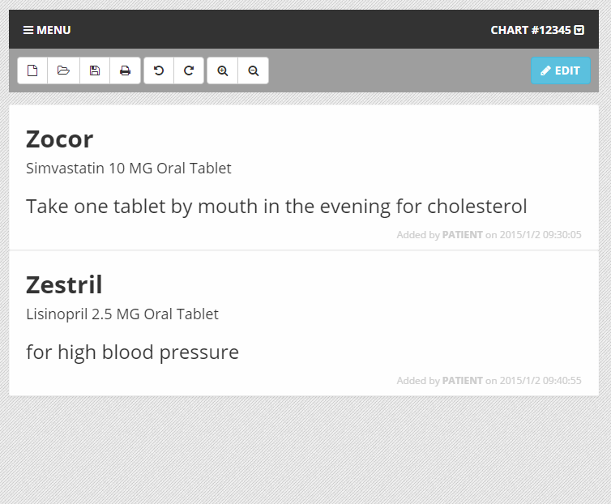
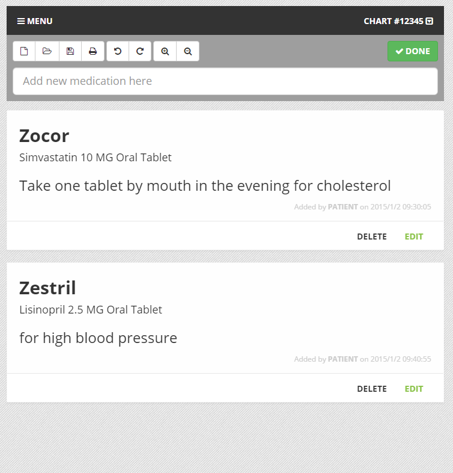
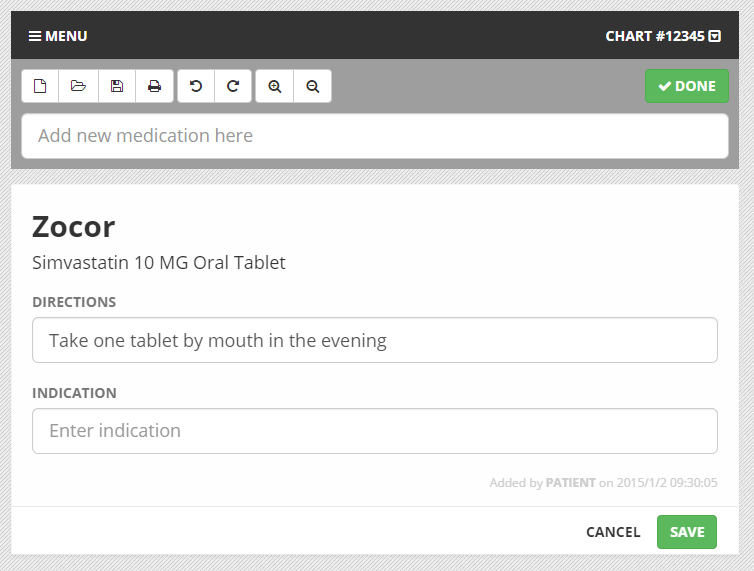
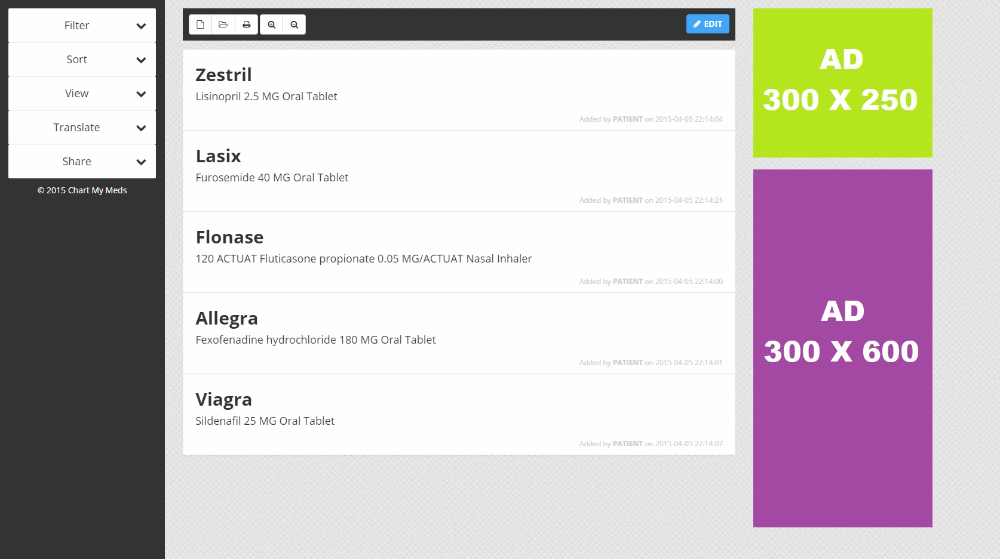
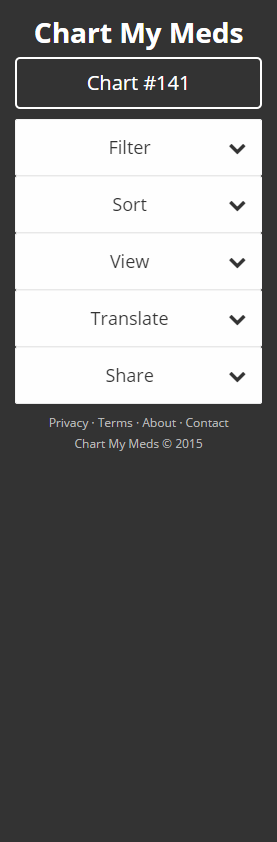

# Chart My Meds (aka medlist)
An easy to use Angular.js medication list made by a pharmacist coder

The idea was a HIPAA compliant medication list that could be freely shared via a URL with no patient identifiers, but which could still be interoperable with multiple different EHRs.

Built out basic integration with the Allscripts EHR Sandbox. Next steps were to integrate BlueButton+ for VA records.

# Images
A basic medication list.

User clicks edit and options appear.

Editing an individual medication reveals inline editing forms.

An idea of the overall layout (ads were an eventual endpoint).

A more recent version of the sidebar with future features of translating and sharing.

